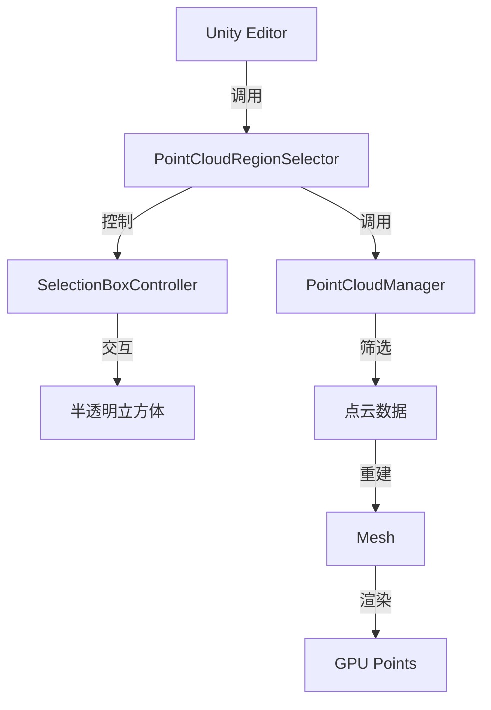

## 产品概述

在Unity PlyTest场景中实现点云编辑功能，通过可视化立方体选择区域来筛选点云数据。

## 核心功能

1. **半透明立方体区域选择器**：创建可交互的半透明立方体，作为点云筛选区域
2. **点云剔除功能**：剔除立方体之外的点云，只保留立方体内部的点云数据
3. **实时预览与恢复**：支持实时预览筛选效果，并可恢复显示所有点云
4. **Editor集成**：在Inspector中提供一键创建、应用和恢复按钮
5. **性能优化**：利用现有空间分桶结构，高效处理大规模点云数据

## 技术栈

- **Unity版本**：支持Unity 2021.3+
- **渲染管线**：Universal Render Pipeline (URP)
- **编程语言**：C# with Unity API
- **MCP集成**：com.coplaydev.unity-mcp (GitHub)
- **Shader**：Custom/PointCloud

## 系统架构

### 架构设计

采用分层架构，在现有PointCloudManager基础上扩展筛选功能：



### 实现策略

1. **创建立方体选择器**：使用Unity skill创建半透明立方体，支持拖拽调整大小和位置
2. **点云筛选算法**：基于Bounds.Contains()方法快速判断点在立方体内外
3. **Mesh重建**：筛选后重新生成Mesh，利用现有空间分桶结构保持性能
4. **数据备份**：筛选前备份原始数据，支持一键恢复
5. **可视化反馈**：立方体半透明材质显示筛选区域，实时预览效果

### 性能优化

- **空间分桶利用**：复用PointCloudManager的spatialGrid结构，避免全量遍历
- **增量更新**：仅更新受影响的网格单元，减少计算量
- **GPU渲染**：继续使用GPU Points渲染，保持高性能
- **异步处理**：筛选操作在后台线程执行，避免阻塞主线程

### 模块划分

1. **PointCloudRegionSelector**：主控制器，管理筛选逻辑和Editor界面
2. **SelectionBoxController**：立方体选择器控制脚本，处理交互
3. **PointCloudManager扩展**：添加筛选和恢复方法
4. **Shader扩展**：可选的裁剪Shader（备用方案）

## 目录结构

```
Assets/
├── Scripts/
│   ├── PointCloudManager.cs              # [MODIFY] 添加筛选和恢复方法
│   ├── PointCloudRegionSelector.cs       # [NEW] 区域选择主控制器
│   └── SelectionBoxController.cs         # [NEW] 立方体交互控制
├── Materials/
│   └── SelectionBoxMaterial.mat          # [NEW] 半透明立方体材质
├── Shaders/
│   └── SelectionBox.shader               # [NEW] 半透明Shader（备用）
└── Prefabs/
    └── SelectionBox.prefab               # [NEW] 立方体预制体
```

## 使用的Agent Extensions

### Skill

- **unity-gameobject**
- 用途：创建半透明立方体选择器
- 预期结果：在场景中生成可交互的立方体GameObject

- **unity-material**
- 用途：创建半透明材质并应用到立方体
- 预期结果：生成半透明的视觉效果，便于观察内部点云

- **unity-component**
- 用途：为立方体添加BoxCollider和SelectionBoxController脚本
- 预期结果：使立方体可交互并具备选择区域功能

- **unity-validation**
- 用途：验证场景中的点云数据和立方体设置
- 预期结果：确保筛选操作前所有必要组件和配置正确

### SubAgent

- **code-explorer**
- 用途：探索PointCloudManager的实现细节，理解空间分桶和Mesh生成逻辑
- 预期结果：深入理解现有代码结构，确保扩展功能与现有架构兼容